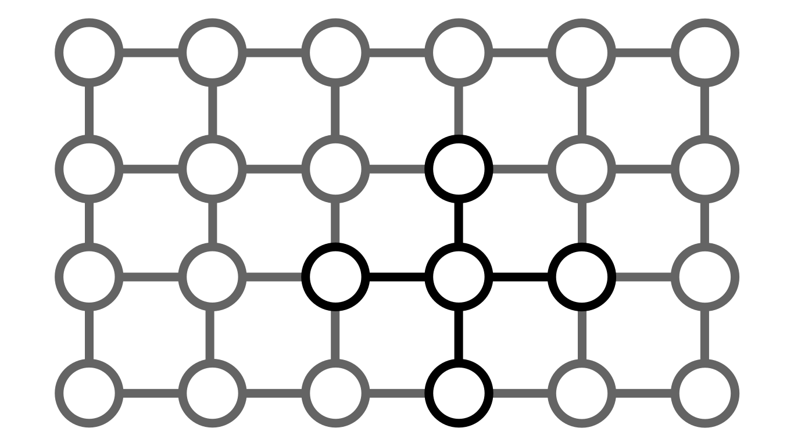

# **TPLS**: Termal Process Lattice Simulator

## Idea

The **TPLS** is an physical simulator runing on top of the Erlang VM. It is based on discretizing the **heat equation**:

$$ \frac{\partial T}{\partial t} = \alpha \nabla^2 T $$

The TPLS uses a lattice of erlang processes which exchange messages. All processes are supervized to prevent premature crashes. 

