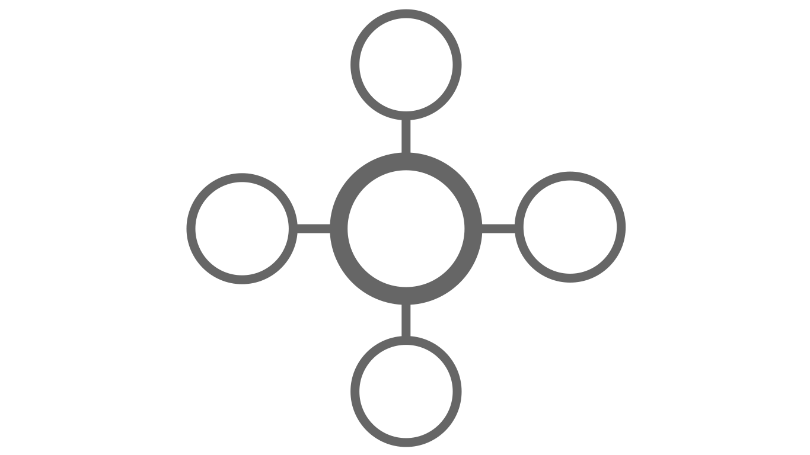
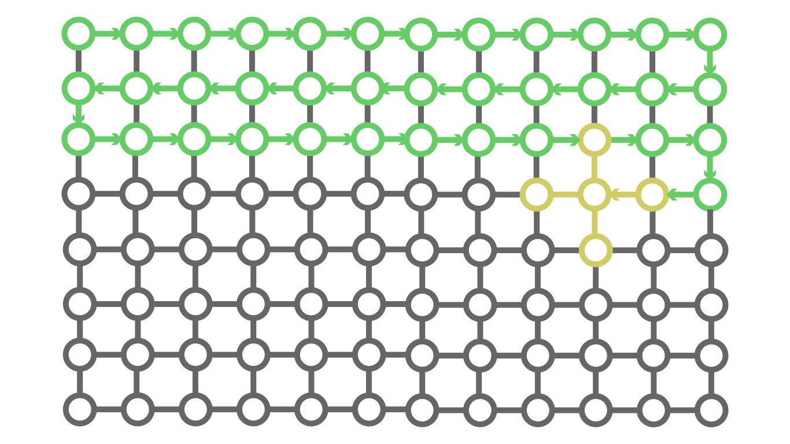

# **TPLS**: Thermal Process Lattice Simulator

## The Idea

The **TPLS** is an physical simulator runing on top of Erlang. It is based on discretizing the **heat equation**:

$$ \frac{\partial T}{\partial t} = \alpha \nabla^2 T $$

The **TPLS** uses a **lattice** of erlang **processes** (*shortly: nodes*) which exchange messages. All nodes are supervized by *"Big Brother"* who prevents premature crashes. 

## The Scheme

This is how the TPLS operates. In the blueprint every node is represented by a circle. The lines are logical connections. This is how the lattice looks like:


Every node knows its temperature and neighbors:



For time evolution, the node has to request the temperatures of its neighbors, the thermal diffusivity and the basis of the system which are stored in the state of the supervisor and calcutate the next temperature via the **discrete heat equation**:

$$ \Delta T = \alpha \nabla^2 T \Delta t $$

Here $\Delta T$ is the change in the temperature of the node. $\alpha$ is the diffusivity of the system. And $\Delta t$ is the time interval. $\nabla^2 T$ is the **Laplacian** of the temperature. It measures how close is the temperaure of the node to the average of its neighbours. The **Laplacian** operator can be calculated like this:

$$ \nabla^2 T = \frac{1}{\Delta x^2} \left( \sum{\partial T} - 4T \right) $$

Where $\sum{\partial T}$ means *the sum of its neighbors*. $\Delta x$ is the distance between the nodes.

> Note:
>
> This is not a generalized formula for the Laplacian. For the general case let $n \left(\partial T \right)$ be the number of neighbors. Then the general Laplacian is:
>
> $$ \nabla^2 T = \frac{1}{\Delta x^2} \left( \sum{\partial T} - n \left( \partial T \right) T \right) $$
>
> This is the actual forumla used in the TPLS.

To calculate every node's new temperature we have to traverse the lattice. The algorithm for this looks like this scheme:



Now let's talk about the supervisor: The Big Brother. He looks after all processes in the lattice. When a process exits Big Brother has to replace it. The temperature of the new process is the average of its neighours.

The thermal diffusivity coefficient is stored in Big Brother. For time evolution every process has to request the coefficient for Big Brother.

Here is a table of the used materials in the TPLS and their coefficient:

<center>

| Material | Thermal Diffusivity |
| ---: | :--- |
| carbon | 216.6 |
| silver | 165.63 |
| gold | 127 |
| copper | 111 |
| aluminium | 97 |
| silicon | 88 |
| tin | 40 |
| iron | 23 |
| glass | 0.34 |
| brick | 0.27 |
| rubber | 0.11 |

</center>

> Note:
>
> The TPLS uses units of $mm^2/s$ for thermal diffusivity.

## The Setup

The **TPLS** is build for Linux. It can be used on other OS, but you have to configure it manualy. Firstly, pull the source code. Then run the ``compiler.sh`` script:

```console
chmod +x ./compiler.sh
```

```console
./compiler.sh
```

This script compiles every erlang module in the repository. Now, you can open the erlang shell with the ``erl`` command and use the ``node``, ``bigbrother`` and ``therm`` modules.

## The Simulator

### The 1D Case

Let's build a simulation. Firstly, we will initialize an "empty" ``bigbrother`` process:

```erlang
BB = bigbrother:start().
```

By default the material of the system is set to iron. You can change it by passing the name of the material as an argument to the ``bigbrother:start/1`` function:

```erlang
Material = gold,
BB = bigbrother:start(Material).
```

For simplisity we will simulate how the temperature of a beam evolves. Let's create a 1D basis. It will begin at $x = -1$ and it will end at $x = 1$. We will use $\Delta x = 0.1$:

```erlang
Start = -1,		% mm
End = 1,		% mm
DX = 0.1,		% mm

X = therm:base(Start, DX, End).
```

> Note:
> 
> The TPLS uses 1 mm as 1 unit length and 1 s for 1 unit time. For temperature the TPLS uses Kelvin. This means that the basis ``X`` starts from -1 mm and ends in 1 mm. The distance between the nodes is 0.1 mm.
> 
> Also I will comment the units of a variable when it is initialized if you haven't read the note just in case.

Let's use $T \left(x\right) = 20 e^{-x^2} + 300$. To get the temperatures of the beam, we will use ``therm:beam/2`` function:

```erlang
F = fun
	(X) -> 20 * math:exp( - X * X ) + 300
end,

T = therm:beam(F, X).	%% K
```

Now let's create the processes. We will message the ``bigbrother`` process as developers. We will tell Big Brother to create a beam with temperatures ``T``:

```erlang
BB ! { dev, { start, { beam, T } } }.
```

Then we will tell him that we have used ``X`` as a basis:

```erlang
BB ! { dev, { set, { basis, X } } }.
```

Now we are ready to simulate how the temperatures of the beam will evolve. Simply message the supervisor like this:

```erlang
DT = 0.01,		%% s
BB ! { dev, { evolve, DT } }.
```

This will evolve the state with $\Delta t = 0.01$ seconds.

> Note:
>
> Do not use big values for $\Delta t$. It will break the simulation. Try to use as small as possible value for $\Delta t$. Do not use zero or negative numbers. I case you want more formal warning:
>
> $$ 1 \gg \Delta t > 0 $$

Unfortunately this is a very slow time evolution. Let's speed things up. We will still use $\Delta t = 0.01$, but we will repeat the calculation many, many times. Let's use a total time of 1 second:

$$ t = 1 $$

To see how many times we have to do the simulation we will divide the total time by the time interval of one simulation:

$$ N = \frac{t}{\Delta t} $$

For our case that is $N = 100$. This means: *"for every 1 second we have to do 100 simulations"*. It is challenging to send 100 messages manualy so we can bypass this this torture by sending this:

```erlang
TotalTime = 1,		%% s
N = TotalTime / DT,

BB ! { dev, { nevolve, N, DT } }.
```

Good. You did it! This wasn't hard was it?

### The 2D Case

How about a 2D simulation? 2D is the same as 1D except we have to include one more base. Let's see how to code this. Let's create two basis:

```erlang
X = therm:base(-1, 0.1, 1),
Y = therm:base(-2, 0.1, -2).
```

Here our X axis will start at $x = -1$ and end at $x = 1$ and the Y axis will start at $y = -2$ and end at $y = 2$.

> Note:
>
> Both basis must have the same distanse between nodes:
>
> $$ \Delta x = \Delta y $$

Now let's create a mesh basis. We will simply use the ``therm:mesh/2`` function. This will create a 2D list of all positions:

```erlang
Mesh = therm:mesh(X, Y).
```

> Note:
>
> You can use the ``therm:square/1`` function for ``X = Y`` cases. These lines of code are equivalent:
>
> ```erlang
> Mesh = therm:mesh(X, X).
> ```
>
> ```erlang
> Mesh = therm:square(X).
> ```

In 2D our thermal function will look like this:

```erlang
F = fun	
	({ X, Y }) -> 20 * math:exp( - X * X - Y * Y ) + 300
end.
```

Let's apply this to our mesh using the ``therm:sheet/2`` function:

```erlang
T = therm:sheet(F, Mesh).
```

We are almost done. Let's send the temperatures and mesh to the Big Brother:

```erlang
BB ! { dev, { start, { sheet, T } } },
BB ! { dev, { set, { mesh, Mesh } } }.
```

And we are done. The time evolution is the same as 1D so you know the drill.
