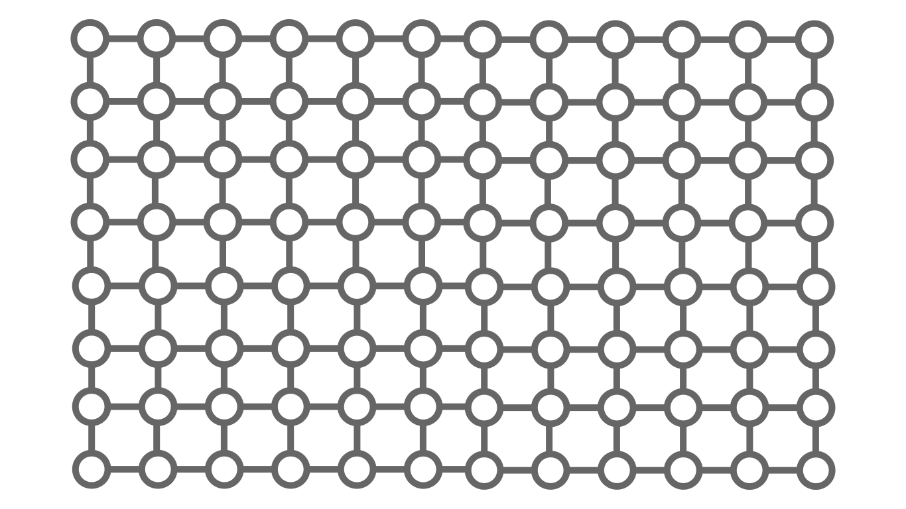

# **TPLS**: Thermal Process Lattice Simulator

## The Idea

The **TPLS** is an physical simulator runing on top of Erlang. It is based on discretizing the **heat equation**:

$$ \frac{\partial T}{\partial t} = \alpha \nabla^2 T $$

The **TPLS** uses a **lattice** of erlang **processes** (*shortly: nodes*) which exchange messages. All nodes are supervized by *"Big Brother"* who prevents premature crashes. 

## The Scheme

In the schemes every node is represented by a circle. The lines are logical connections. This is how the lattice looks like:



Every node knows its temperature and neighbors:


For time evolution, the node has to request the temperatures of its neighbors, the thermal diffusivity of the supervisor, and calcutate the next temperature via the **heat equation**:

$$ \Delta T = \alpha \nabla^2 T \Delta t $$

The **Laplacian** operator can be calculated like this:

$$ \nabla^2 T = \frac{1}{\Delta x^2} \left( \sum{\partial T} - 4T \right) $$

where $\sum{\partial T}$ means *the sum of its neighbors*.

> Note:
>
> This is not a generalized formula for the Laplacian. For the general case let $n \left(\partial T \right)$ be the number of neighbors. Then the general Laplacian is:
>
> $$ \nabla^2 T = \frac{1}{\Delta x^2} \left( \sum{\partial T} - n \left( \partial T \right) T \right) $$

## The Setup

The **TPLS** is build for Linux. It can be used on other OS, but you have to configure it manualy. Firstly, pull the source code. Then run the ``compiler.sh`` script:

```console
$ chmod +x ./compiler.sh
$ ./compiler.sh
```

This script compiles every erlang module in the repository. Now, you can open the erlang shell with the ``erl`` command and use the ``node`` and ``bigbrother`` modules.

## The Simulator

Let's build a simulation. Firstly, we will initialize an "empty" ``bigbrother`` process:

```erlang
BB = bigbrother:start().
```

By default the material of the system is set to iron. You can change it by passing the name of the material as an argument to the ``bigbrother:start/1`` function:

```erlang
Material = gold,
BB = bigbrother:start(Material).
```

For simplisity we will simulate how the temperature of a beam evolves. Let's create a basis. It will begin in $x = -1$ and it will end in $x = 1$. We will use $\Delta x = 0.1$:

```erlang
Start = -1,		% mm
End = 1,		% mm
DX = 0.1,		% mm

X = therm:basis(Start, DX, End).
```

> Note:
> 
> The TPLS uses 1 mm as 1 unit length and 1 s for 1 unit time. For temperature the TPLS uses Kelvin. This means that the basis ``X`` starts from -1 mm and ends in 1 mm. The distance between the nodes is 0.1 mm.
> 
> Also I will comment the units of a variable when it is initialized if you haven't read the note just in case.

Let's use $T \left(x\right) = 20 e^{-x^2} + 300$. To get the temperatures of the beam, we will use ``therm:beam/2`` function:

```erlang
F = fun
	(X) -> 20 * math:exp( - X * X ) + 300
end,

T = therm:beam(F, X).	%% K
```

Now let's create the processes. We will message the ``bigbrother`` process as developers. We will tall Big Brother to create a beam with temperatures ``T``:

```erlang
BB ! { dev, { start, { beam, T } } }.
```

Now we are ready to simulate how the temperatures of the beam will evolve. Simply message the supervisor like this:

```erlang
DT = 0.1,		%% s
BB ! { dev, { evolve, DT } }.
```

This will evolve the state with $\Delta t = 0.1$ seconds.

> Note:
>
> Do not use big values for $\Delta t$. It will break the simulation. Try to use as small as possible value for $\Delta t$. Do not use zero or negative numbers. I case you want more formal warning:
>
> $$ 1 \gg \Delta t > 0 $$
